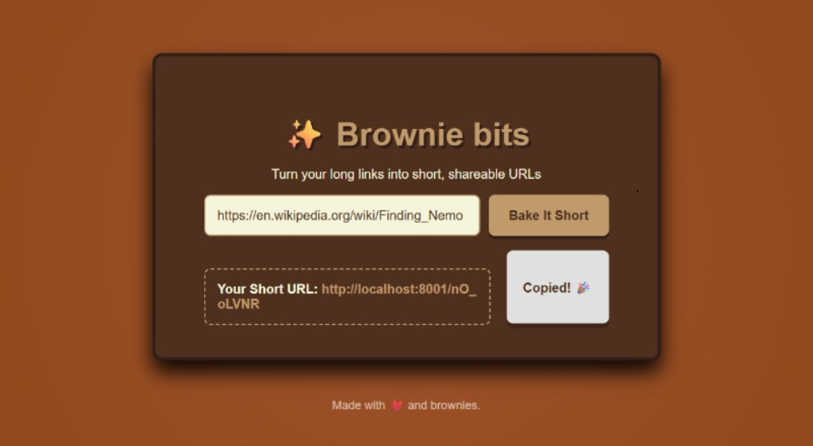

# 🍫 Brownie Bits URL Shortener

A full-stack web application that shortens long URLs into simple, shareable links.

Built with **Node.js, Express, MongoDB, and Nanoid** — with a simple frontend for user interaction.

This project was created as a way to learn backend development using **Node.js + Express** and to practice connecting it with a  **frontend UI** .

---

## 🚀 Features

* Shorten long URLs into short IDs (e.g., `localhost:8001/jAi286at`)
* Redirect users from the short ID to the original long URL
* Track visit history with timestamps in MongoDB
* Simple **frontend** (HTML, CSS, JS) to interact with backend
* RESTful API design
* Built with love and a brownie touch 🍫

---

## 🛠️ Tech Stack

* **Node.js** (server runtime)
* **Express.js** (backend framework)
* **MongoDB + Mongoose** (database for storing URLs & visits)
* **Nanoid** (to generate unique short IDs)
* **HTML, CSS, JavaScript** (frontend UI)

---


## 📸 Screenshot

Here’s how the project looks in action:



The frontend has a **brownie-inspired design** — simple, clean, and made to give a cozy “home-baked” feel to the project.


---

## 📂 Project Structure

```
controllers/   -> Request handling logic
models/        -> Mongoose schemas & models
routes/        -> Express routes
public/        -> Frontend (index.html, style.css, script.js)
connect.js     -> MongoDB connection
index.js       -> Main server entry
```

---

## ⚙️ Installation & Setup

### 1. Clone the repository

```bash
git clone https://github.com/AdeshWardhe/brownie-bits-url-shortener.git
cd brownie-bits-url-shortener
```

### 2. Install dependencies

```bash
npm install
```

### 3. Run MongoDB

Make sure you have **MongoDB** installed locally, or use [MongoDB Atlas](https://www.mongodb.com/atlas).

Start MongoDB:

```bash
mongod
```

### 4. Start the server

```bash
npm start
```

or in development mode (if nodemon is installed):

```bash
npm run dev
```

### 5. Open the app

Go to:

```
http://localhost:8001
```

---

## ✨ Usage

1. Paste any long URL into the frontend form
2. Get a shortened link (e.g., `http://localhost:8001/abc12345`)
3. When visited, the user is redirected to the original URL and the visit count is stored in mongodb

---

## 🙏 Credits

This project was inspired by and learned from a video tutorial by  **Piyush Garg** .

His tutorial gave me the foundation to understand the backend logic — such as working with  **Express routes, MongoDB with Mongoose, and generating short IDs with Nanoid** .

On top of that, I added my own contribution by:

* Designing and coding the **frontend (HTML, CSS, JS)**
* Connecting the frontend with the backend API
* Adding styling and my own “brownie touch”

I want to clearly state that I do **not claim credit for the backend concepts** that I learned directly from the tutorial. My effort and originality are in the **frontend part** and in combining it all together.

**I also believe that credit should always be given when you take inspiration or ideas from someone else’s work — otherwise, it feels like stealing. This is something I truly learned and now follow as a principle.**

---

## 💡 Future Improvements (would love to work further on this project )

* Add user authentication
* Show analytics dashboard for link visits
* Deploy live using **Render / Vercel / MongoDB Atlas**

---
